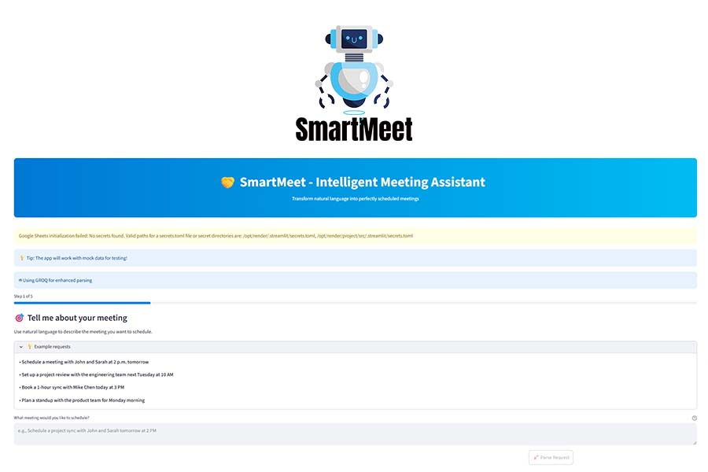

````markdown
# 🤖 SmartMeet — Intelligent Meeting Assistant

**SmartMeet** transforms natural language into perfectly scheduled meetings.  
It uses AI agents to interpret your intent and simulate meeting scheduling — whether it's a 1:1 sync, a team standup, or a project review.

---

## 🌟 Overview

SmartMeet allows users to describe meetings naturally (e.g., *“Schedule a meeting with John and Sarah at 2 p.m. tomorrow”*), and the app automatically processes the request, creating a structured meeting entry.

The current MVP uses **mock data** to simulate calendar and contact integrations. Future releases will integrate with Microsoft Teams and Outlook Calendar APIs for real scheduling.

---

## 🧠 Key Features

- 🗣️ **Natural Language Scheduling** – Create meetings just by typing what you need.  
- 🧾 **Smart Context Parsing** – Extracts participants, times, and topics using GenAI models.  
- 📊 **Step-Based UI** – Guides users through the scheduling process.  
- 🧩 **CrewAI Agent Framework** – Modular AI agents handle parsing, validation, and response generation.  
- 🧰 **Streamlit UI** – Clean, interactive interface with progress tracking and visual feedback.  
- 🧮 **Mock Mode** – Works without external APIs using local JSON data for testing.

---

## 🏗️ Tech Stack

| Layer | Technology |
|-------|-------------|
| **Frontend** | Streamlit |
| **Backend** | Python |
| **AI Framework** | CrewAI |
| **Parsing & NLP** | CIOG / OpenAI-compatible interface |
| **Data Handling** | JSON (mock simulation for MVP) |
| **Planned Integration** | Microsoft Graph API for Teams and Calendar |

---

## 🚀 Getting Started

### 1. Clone the Repository
```bash
git clone https://github.com/yourusername/smartmeet.git
cd smartmeet
````

### 2. Install Dependencies

```bash
pip install -r requirements.txt
```

### 3. Configure Secrets (Optional)

If you plan to connect Google Sheets or external APIs, create a `secrets.toml` file inside:

```
~/.streamlit/secrets.toml
```

Example:

```toml
[connections]
google_sheets_api_key = "your_api_key_here"
```

### 4. Run the App

```bash
streamlit run app.py
```

Then open [http://localhost:8501](http://localhost:8501) in your browser.

---

## 💡 Example Prompts

* “Schedule a meeting with John and Sarah at 2 p.m. tomorrow.”
* “Set up a project review with the engineering team next Tuesday at 10 AM.”
* “Book a 30-min sync with Mike and Chen today at 3 PM.”
* “Plan a standup with the product team for Monday morning.”

---

## 🧩 App Flow

1. User describes the meeting in natural language.
2. The AI agent parses the request into structured data.
3. SmartMeet confirms details (participants, date, duration, purpose).
4. (Future) Integration with Teams or Calendar API for automatic scheduling.

---

## 📸 Screenshot



---

## 📅 Roadmap

* [ ] Integrate Microsoft Teams and Outlook Calendar APIs
* [ ] Add persistent user sessions and history tracking
* [ ] Support voice input for meeting creation
* [ ] Enable recurring meeting scheduling
* [ ] Multi-language support

---

## 📄 License

This project is licensed under the [MIT License](LICENSE).

---

## 👤 Author

Built by **Venkata Sriharsha Siddam**
📧 [Contact Me](mailto:venkatasriharsha557@gmail.com)
🌐 [GitHub Portfolio](https://sriharsha557.github.io/myapps/)

```

---

Would you like me to slightly reformat this version with a centered title and logo (like a portfolio project for your GitHub Pages site), or keep it in this developer-oriented structure?
```
